English · [简体中文](https://github.com/Functionhx/Functionhx/blob/zh-CN/README.md)

---

## About Me

I am an undergraduate Robotics Engineering student at Beijing Institute of Technology, working at the intersection of robotics, autonomous driving, embodied AI, 3D scene representation, and AI systems engineering.

I enjoy turning research prototypes into real systems—from perception, state estimation, and navigation to inference deployment, communication architecture, testing, and fault recovery. Beyond getting a demo to run, I care about reliability, reproducibility, and graceful recovery when things go wrong.

- **Currently building** — 3DGS visual localization, instance navigation, and editable road-scene generation
- **Exploring** — ROS 2, Nav2, Habitat, VLA/VLN, world models, and AI agents
- **Engineering** — reliable real-robot systems, AI inference deployment, autonomous-driving infrastructure, and open-source software
- **Let's talk about** — embodied AI, 3D scene intelligence, robotics middleware, AI infrastructure, and research automation
- **Highlights** — 20 merged upstream PRs; Kaggle Bronze Medal (solo, top 9.9%)

---

## Featured Projects

<table>
<tr>
<td width="50%" valign="top">

### ⭐ [Batch-LIO](https://github.com/Functionhx/Batch-LIO)

A batch-wise extension of Point-LIO featuring within-window motion undistortion, batched EKF updates, and parallel computation for high-bandwidth LiDAR-inertial odometry.

`C++` `LiDAR-Inertial Odometry` `EKF` `ROS`

</td>
<td width="50%" valign="top">

### ⭐ [BITFSD-Annotator](https://github.com/Functionhx/BITFSD-Annotator)

A 3D annotation and AI-assisted pre-labeling platform for Formula Student Driverless point clouds, with quality gates, OpenPCDet export, and a TensorRT inference backend.

`3D Vision` `TensorRT` `Vue` `FastAPI`

</td>
</tr>

<tr>
<td width="50%" valign="top">

### [CatchLab](https://github.com/Functionhx/catchlab)

An open simulation and verification framework for reusable-launch-vehicle terminal recovery — return flight, GNC, tower and arrestor-cable catch dynamics, and a SIL → HIL → scaled-experiment path built for explainable, reproducible sim-to-real.

`Rocket Recovery` `GNC` `Sim-to-Real` `C++20`

</td>
<td width="50%" valign="top">

### [ActuateX](https://github.com/Functionhx/actuatex)

A three-backend (Isaac Gym / Isaac Lab / MuJoCo) reinforcement-learning classroom for robust locomotion — train a policy in one simulator, then make it prove itself under unfamiliar dynamics, sustained pushes, stairs, and a different physics engine.

`Reinforcement Learning` `Sim2Sim` `Robot Control` `Isaac Lab`

</td>
</tr>
</table>

---

## Open-Source Contributions

Contributed **28 merged pull requests** across AI infrastructure, robotics middleware, databases, developer tooling, security tooling, and scientific computing — ordered below by impact.

| Project | Pull Request | Focus |
|---|---|---|
| vLLM | [#48153](https://github.com/vllm-project/vllm/pull/48153) | Mistral Large 3 → AutoWeightsLoader |
| OpenCV | [#29487](https://github.com/opencv/opencv/pull/29487) | Calibration docs & projection-matrix fixes |
| DeepSpeed | [#8154](https://github.com/deepspeedai/DeepSpeed/pull/8154) | Pipeline gradient-scaling fix |
| Nautilus Trader | [#4443](https://github.com/nautechsystems/nautilus_trader/pull/4443) | Consolidation data-loss fix |
| ccxt | [#29192](https://github.com/ccxt/ccxt/pull/29192) | Backpack ticker normalization |
| DuckDB | [#23773](https://github.com/duckdb/duckdb/pull/23773) | VARCHAR→DECIMAL rounding fix |
| cargo | [#17203](https://github.com/rust-lang/cargo/pull/17203) | Flaky-test race fix |
| Hugging Face TRL | [#6439](https://github.com/huggingface/trl/pull/6439) | GRPO loss normalization |

<b>View all 28 merged PRs (by impact)</b>

 

1. [vllm-project/vllm #48153](https://github.com/vllm-project/vllm/pull/48153)
2. [opencv/opencv #29487](https://github.com/opencv/opencv/pull/29487)
3. [deepspeedai/DeepSpeed #8154](https://github.com/deepspeedai/DeepSpeed/pull/8154)
4. [nautechsystems/nautilus_trader #4443](https://github.com/nautechsystems/nautilus_trader/pull/4443)
5. [ccxt/ccxt #29192](https://github.com/ccxt/ccxt/pull/29192)
6. [duckdb/duckdb #23773](https://github.com/duckdb/duckdb/pull/23773)
7. [rust-lang/cargo #17203](https://github.com/rust-lang/cargo/pull/17203)
8. [huggingface/trl #6439](https://github.com/huggingface/trl/pull/6439)
9. [biomejs/biome #10915](https://github.com/biomejs/biome/pull/10915)
10. [deepspeedai/DeepSpeed #8144](https://github.com/deepspeedai/DeepSpeed/pull/8144)
11. [NVIDIA/cccl #9785](https://github.com/NVIDIA/cccl/pull/9785)
12. [OpenRLHF/OpenRLHF #1261](https://github.com/OpenRLHF/OpenRLHF/pull/1261)
13. [huggingface/trl #6348](https://github.com/huggingface/trl/pull/6348)
14. [BishopFox/sliver #2286](https://github.com/BishopFox/sliver/pull/2286)
15. [vyperlang/vyper #5185](https://github.com/vyperlang/vyper/pull/5185)
16. [eclipse-cyclonedds/cyclonedds #2425](https://github.com/eclipse-cyclonedds/cyclonedds/pull/2425)
17. [ros-controls/ros2_control #3454](https://github.com/ros-controls/ros2_control/pull/3454)
18. [Farama-Foundation/Gymnasium #1618](https://github.com/Farama-Foundation/Gymnasium/pull/1618)
19. [conda/conda #16391](https://github.com/conda/conda/pull/16391)
20. [Velocidex/velociraptor #4921](https://github.com/Velocidex/velociraptor/pull/4921)
21. [eclipse-iceoryx/iceoryx2 #1818](https://github.com/eclipse-iceoryx/iceoryx2/pull/1818)
22. [ros2/ros2cli #1257](https://github.com/ros2/ros2cli/pull/1257)
23. [fullpage-lab/PatchWing #3](https://github.com/fullpage-lab/PatchWing/pull/3)
24. [rsheftel/pandas_market_calendars #469](https://github.com/rsheftel/pandas_market_calendars/pull/469)
25. [ros2/rmw_cyclonedds #591](https://github.com/ros2/rmw_cyclonedds/pull/591)
26. [fullpage-lab/PatchWing #1](https://github.com/fullpage-lab/PatchWing/pull/1)
27. [Unclecheng-li/poc-lab #21](https://github.com/Unclecheng-li/poc-lab/pull/21)
28. [Unclecheng-li/poc-lab #20](https://github.com/Unclecheng-li/poc-lab/pull/20)

---

## Technologies & Tools

---

## GitHub Stats

<table width="100%">
<tr>
<td width="50%">

</td>
<td width="50%">

</td>
</tr>
</table>

---

### If you are exploring robotics, embodied AI, 3D scene representation, or reliable AI systems, let's connect

